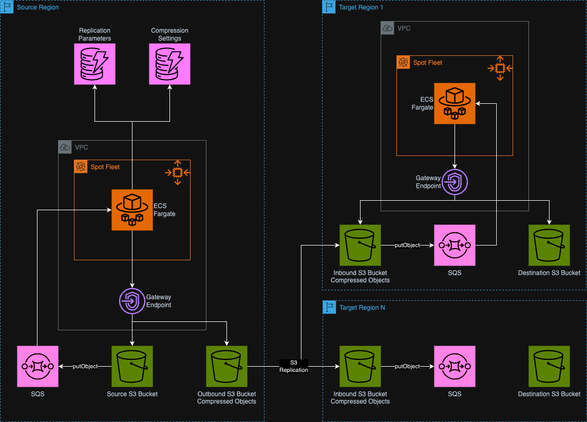

# S3 Cross-Region Data Transfer Compression Engine

A reference architecture for a high-performance system for compressing and replicating S3 objects across AWS regions with optimized network transfer and storage efficiency.

## Overview

S3 Cross-Region Compressor is a solution that automatically compresses S3 objects and replicates them across multiple AWS regions. The system provides significant cost savings on cross-region data transfer and storage while maintaining data integrity and availability.

### Key Features

- **Efficient Compression**: Uses zstd compression with multi-threading and dynamic memory optimization for optimal compression ratio and speed
- **Adaptive Optimization**: Automatically selects the best compression level based on historical data with statistical analysis and CPU performance normalization
- **Cost-Benefit Analysis**: Calculates real-time metrics on compression vs. transfer cost trade-offs with weighted analysis
- **Cross-Region Replication**: Replicates objects to multiple target regions leveraging native S3 Replication with optimized rule configuration
- **Dynamic Scaling**: Adjusts concurrency based on system load and queue depth with configurable backlog-per-task strategy
- **Comprehensive Metrics**: Collects detailed CloudWatch metrics for monitoring and cost saving analysis with region-specific tracking
- **Flexible Configuration**: Supports multiple regions and replication rules with fine-grained control and optimistic concurrency
- **Data Integrity**: Maintains object metadata, tags, storage classes, and directory structure during replication
- **Enhanced Security**: Containers run as non-root users with comprehensive security controls and minimal attack surface

## Architecture

The system consists of two main components:

1. **Source Region Service**: 
   - Monitors S3 buckets for new objects via SQS event notifications
   - Gathers object metadata (including tags and storage class) and builds a manifest file
   - Preserves relative path structure using monitored prefixes
   - Runs CPU benchmarking at startup to normalize performance metrics
   - Compresses objects and manifest using zstd compression with adaptive optimization
   - Uses dynamically sized compression buffers based on available memory
   - Immediately deletes temporary files after archiving to conserve disk space
   - Stores the compressed archives in a staging S3 Bucket
   - Tracks compression metrics in DynamoDB with optimistic concurrency control
   - S3 Replicates the compressed data to the Target Region(s)
   - S3 Lifecycle policy deletes the objects 1 day old after replication
   - [Detailed Source Region documentation](docs/source_region/README.md)

2. **Target Region Service**:
   - Receives compressed objects via a staging local S3 Bucket
   - Monitors the target staging S3 buckets for new objects via SQS event notifications
   - Downloads and decompresses archives using streaming extraction
   - Processes one object at a time to minimize disk usage
   - Only extracts objects intended for the current region
   - Preserves original storage class or applies target-specific storage class overrides
   - Stores objects in target S3 buckets according to manifest information (target bucket, prefix, tags, etc.)
   - Deletes extracted files immediately after successful upload
   - Deletes staging S3 object to save costs once all objects are processed
   - [Detailed Target Region documentation](docs/target_region/README.md)

The system uses separate, independently scaling services for each source configuration (bucket/prefix) but only one target service per region to handle all objects.



For detailed information about:
- System architecture, data flow, and component details, see [ARCHITECTURE.md](docs/ARCHITECTURE.md)
- Security features and best practices, see [SECURITY.md](docs/SECURITY.md)
- Backup mode configuration and catalog querying, see [BACKUP_MODE.md](docs/BACKUP_MODE.md)

## Prerequisites

- Python 3.9+
- AWS CLI
- AWS CDK v2.180.0+
- **Docker or Finch** (required for building containers)
  - Docker: https://www.docker.com/
  - Finch: https://github.com/runfinch/finch (recommended for macOS)

## Installation

1. Clone the repository:
   ```
   git clone https://github.com/yourusername/s3-cross-region-compressor.git
   cd s3-cross-region-compressor
   ```

2. Create and activate a virtual environment:
   ```
   python3 -m venv .venv
   source .venv/bin/activate  # On Windows: .venv\Scripts\activate.bat
   ```

3. Install dependencies:
   ```
   pip install -r requirements.txt
   ```

## Configuration

The system is configured using JSON files in the `configuration` directory:

- `settings.json`: General settings including enabled regions and their roles
- `replication_config.json`: Replication rules for S3 buckets, including source and destination details

For detailed configuration options and examples, see [CONFIGURATION.md](docs/CONFIGURATION.md).

## Building Containers

**IMPORTANT**: You must build the container images before deploying the system. The deployment process requires the container tar files to be present.

### Prerequisites for Building

Ensure you have one of the following container engines installed:
- **Docker**: https://www.docker.com/ 
- **Finch**: https://github.com/runfinch/finch

### Build Process

1. **Linux/macOS**: Run the build script:
   ```bash
   chmod +x build_containers.sh
   ./build_containers.sh
   ```

2. **Windows**: Run the Windows build script:
   ```cmd
   build_containers.bat
   ```

### What the Build Script Does

The build process will:
1. Check for required dependencies (Docker/Finch)
2. Optionally refresh Python dependencies if UV is available
3. Build ARM64 containers for both source and target regions
4. Save container images as tar files in `./bin/dist/`

### Verification

After building, verify the containers were created successfully:
```bash
ls -la bin/dist/
# Should show:
# source_region.tar
# target_region.tar
```

If the build fails, check that:
- Docker or Finch is installed and running
- You have sufficient disk space
- Your container engine supports ARM64 builds

## Deployment

The system is deployed using AWS CDK:

1. Configure your AWS credentials:
   ```
   aws configure
   ```

2. Bootstrap CDK in each region (first-time only):
   ```
   cdk bootstrap
   ```

3. Deploy the stacks:
   ```
   cdk deploy --all
   ```

For detailed deployment instructions, troubleshooting, and verification steps, see [DEPLOYMENT.md](docs/DEPLOYMENT.md).

## Adaptive Compression

The system includes an intelligent adaptive compression system (implemented in the Source Region Service) that automatically optimizes compression levels based on historical performance and cost-benefit analysis:

- Uses zstd compression with levels 1-22 and multi-threading for parallel processing
- Runs CPU benchmarking at startup to compare container performance to fleet average
- Calculates per-object benefit scores for fair comparison across varying batch sizes
- Adjusts compression levels based on relative CPU performance:
  - Faster CPUs use higher compression levels for better ratios
  - Slower CPUs use lower levels for better throughput
  - Average CPUs use the empirically best performing level
- Implements a multi-tier exploration strategy (12% ±1 level, 5% ±2 levels, 3% ±3 levels)
- Records aggregated compression metrics in DynamoDB with atomic updates
- Requires minimum sample size (10 trials per level) for statistical significance
- Implements optimistic concurrency control with automatic retries for distributed operations
- Automatically selects optimal compression levels based on data type characteristics
- Uses dynamic memory management with buffer sizes based on available system memory

### Observed Compression Ratios

Real-world compression ratios achieved by the system vary significantly by file type:

| Content Type | File Size | Compression Ratio |
|--------------|-----------|------------------|
| Snappy Parquet | 10-100mb | 1.2:1 |
| Mixed Content | 10-100mb | 2.22-2.93:1 |
| CSV Files | 10-100mb | 2.71-2.72:1 |
| OCR Content | 10-100mb | 3.91-3.97:1 |
| XML Files | 10-1000mb | 3.98-4.22:1 |

*Note: Actual compression ratios may vary depending on your specific data characteristics.*

For technical implementation details, see the [Source Region documentation](docs/source_region/README.md#adaptive-compression-system).  
For a comprehensive overview of the adaptive compression architecture and theory, see [ADAPTIVE_COMPRESSION.md](docs/ADAPTIVE_COMPRESSION.md).

## Monitoring

The system publishes detailed metrics to CloudWatch under a namespace with the same name as the `stack_name` defined in the `settings.json`, including:

- **Compression Performance**:
  - Compression ratio
  - Bytes saved
  - Processing time
- **Cost Metrics**:
  - Transfer savings
  - Compute cost
  - Net benefit
  - Cost-benefit score
- **Operational Metrics**:
  - Queue depth
  - Objects processed
  - Failure counts

### CloudWatch Alarms

The system automatically configures critical CloudWatch alarms to monitor service health:

- **DLQ Message Count**: Alerts when ANY message appears in Dead Letter Queues
- **ECS Task Failures**: Alerts when tasks are failing repeatedly
- **Task Utilization**: Alerts when services are at max capacity for extended periods

Alarm notifications are sent to email addresses specified in the `notification_emails` field in `settings.json`.

For comprehensive monitoring guidance, dashboard examples, and detailed alarm configuration, see [MONITORING.md](docs/MONITORING.md).

## Cost Optimization

The system automatically optimizes costs in several ways:

- **Reduced Data Transfer**: Compresses data before cross-region transfer to reduce AWS network charges
- **Spot and Graviton**: The ECS Fargate compute fleet is optimized by using Spot and Graviton for maximum performance and reduced cost
- **Adaptive Compression**: Dynamically balances compression level vs. compute cost with CPU normalization
- **Memory Optimization**: 
  - Dynamically allocates compression buffer sizes based on available memory
  - Implements streaming compression to process large files efficiently
  - Immediately deletes temporary files after use to minimize storage requirements
- **Targeted Processing**: Only extracts and processes objects intended for the current region
- **Storage Management**: 
  - Preserves original storage classes or applies configuration-based overrides
  - Deletes staging objects immediately after successful processing
- **Auto-scaling**: Scales to zero when idle to eliminate unnecessary compute costs with backlog-per-task strategy (see [FARGATE_SCALING.md](docs/FARGATE_SCALING.md))
- **Real-time Cost-Benefit Analysis**: Calculates if compression is worthwhile for each data type with fine-tuned overhead factors

The system leverages the AWS Pricing API at deployment time to get accurate transfer costs between regions and compute cost when making optimization decisions. Transfer costs and compute costs are configurable via environment variables (DATA_TRANSFER_COST, FARGATE_COST_PER_MINUTE).

For detailed cost optimization strategies, examples of real-world savings, and best practices, see [COST_OPTIMIZATION.md](docs/COST_OPTIMIZATION.md).

## Cost Estimation

The S3 Cross-Region Compressor solution delivers significant cost savings for cross-region data transfers, particularly at scale. This section provides a summary of cost considerations based on real-world scenarios.

### Fixed Infrastructure Costs

The solution requires certain fixed infrastructure components, most notably:

- **VPC Interface Endpoints**: $87.60/month for required endpoints across regions
- **KMS Keys**: Additional $9.00/month for encryption keys
- **Other Infrastructure**: Including ECR repositories and CloudWatch alarms

These fixed costs are offset by savings on data transfer when sufficient data volume is transferred.

### Scenario Analysis: 500TB Data Transfer with 3x compressions

Based on the cost analysis from our [cost-estimations.xlsx](./cost-estimations.xlsx) spreadsheet:

#### Scenario 1: 500TB to 1 Target Region

| Component | Without Compression | With Compression + ECS |
|-----------|---------------------|------------------------|
| Data Transfer Cost | $10,240.00 | $3,413.33 |
| Compression/Decompression | $0.00 | $259.35 |
| Fixed Costs | $0.00 | $172.20 |
| S3 Staging & Other Costs | $0.00 | $474.70 |
| **Total Cost** | **$10,240.00** | **$4,322.58** |
| **Savings** | | **$5,917.42 (58%)** |


#### Scenario 2: 500TB to 2 Target Region

| Component | Without Compression | With Compression + ECS |
|-----------|---------------------|------------------------|
| Data Transfer Cost | $20,480.00 | $6,826.67 |
| Compression/Decompression | $0.00 | $259.35 |
| Fixed Costs | $0.00 | $262.80 |
| S3 Staging & Other Costs | $0.00 | $661.03 |
| **Total Cost** | **$20,480.00** | **$8,009.85** |
| **Savings** | | **$12,470.15 (61%)** |

### Break-Even Analysis

The solution's cost efficiency increases with data volume:

- **Single Region Transfer**: Break-even point at approximately 15TB/month
- **Dual Region Transfer**: Break-even point at approximately 10TB/month

For operations below these thresholds, standard S3 replication may be more cost-effective due to fixed infrastructure costs.

### Detailed Cost Analysis

For comprehensive cost calculations, refer to the [cost-estimations.xlsx](./cost-estimations.xlsx) spreadsheet, which contains detailed breakdowns of:

- Compression ratios and efficiency metrics
- Compute resource utilization
- Multi-region transfer scenarios
- Detailed component costs

## Troubleshooting

Common issues and their solutions are documented for:

- **Deployment Issues**: CDK deployment failures, container build issues
- **Configuration Issues**: SSM parameter problems, KMS key access, region mismatches
- **Runtime Issues**: Objects not being compressed or replicated, manifest errors
- **Performance Issues**: High compression times, queue backlogs, low compression ratios

For detailed troubleshooting procedures, log analysis techniques, and advanced diagnosis methods, see [TROUBLESHOOTING.md](docs/TROUBLESHOOTING.md).

## Project Structure

```
s3-cross-region-compressor/
├── app.py                      # CDK app entry point
├── bin/                        # Container application code
│   ├── source_region/          # Source region service
│   │   ├── server.py           # Main service entry point
│   │   └── utils/              # Utility modules
│   │       ├── compression_manager.py
│   │       ├── compression_optimizer.py
│   │       └── cost_benefit_calculator.py
│   └── target_region/          # Target region service
│       ├── server.py           # Main service entry point
│       └── utils/              # Utility modules
├── configuration/              # Configuration files
│   ├── settings.json           # General settings
│   └── replication_config.json # Replication rules
├── s3_cross_region_compressor/ # CDK infrastructure code
│   ├── baseline_resources_stack.py
│   ├── s3_replication_stack.py
│   ├── source_service_stack.py
│   └── resources/              # Resource constructs
├── docs/                       # Detailed documentation
│   ├── images/                 # Architecture diagrams
│   ├── ARCHITECTURE.md         # Overall system architecture
│   ├── CONFIGURATION.md        # Configuration guide
│   ├── DEPLOYMENT.md           # Deployment instructions
│   ├── ADAPTIVE_COMPRESSION.md # Adaptive compression details
│   ├── MONITORING.md           # Monitoring guidance
│   ├── FARGATE_SCALING.md      # Service scaling strategy
│   ├── BACKUP_MODE.md          # Backup mode configuration
│   ├── SECURITY.md             # Security guardrails
│   ├── source_region/          # Source application documentation
│   │   └── README.md           # Source region service details
│   └── target_region/          # Target application documentation
│       └── README.md           # Target region service details
└── tests/                      # Tests
```

### Useful Commands

- `cdk ls`          List all stacks in the app
- `cdk synth`       Emit the synthesized CloudFormation template
- `cdk deploy`      Deploy this stack to your default AWS account/region
- `cdk diff`        Compare deployed stack with current state
- `cdk docs`        Open CDK documentation

## License

This project is licensed under the MIT License - see the LICENSE file for details.

## Contributing

Contributions are welcome! Please feel free to submit a Pull Request.
