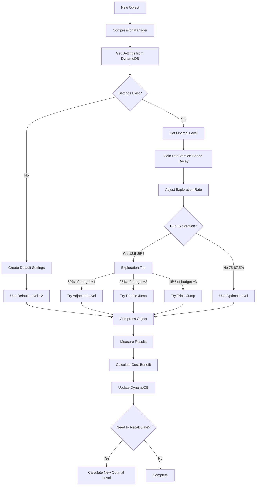

# Adaptive Compression System

The S3 Cross-Region Compressor includes an intelligent adaptive compression system that automatically optimizes compression levels based on historical performance and cost-benefit analysis. This system is implemented by the **Source Region Service** component and represents one of the core features of the solution. This document explains how this system works and how to monitor and tune its performance.

> **Note**: For implementation details specific to the Source Region Service's use of adaptive compression, see the [Source Region documentation](source_region/README.md#adaptive-compression-system).

## Overview

Rather than using a fixed compression level, the system dynamically adjusts compression settings to find the optimal balance between:

- **Compression ratio**: Higher compression reduces transfer costs
- **Compression time**: Lower CPU usage reduces compute costs
- **Data characteristics**: Different data types benefit from different compression levels

The goal is to maximize the "benefit score" - a metric that balances transfer cost savings against computational costs.

## System Architecture



## Components

### 1. Compression Manager (`compression_manager.py`)

The Compression Manager acts as a facade for the adaptive compression system. It:

- Retrieves optimal compression levels from DynamoDB
- Updates metrics after compression operations
- Implements retry logic and error handling

Key functions:
- `get_compression_level()`: Retrieves the optimal level for a bucket/prefix
- `update_compression_metrics()`: Records metrics and updates optimal levels
- `occasionally_test_new_level()`: Implements the exploration strategy

### 2. Compression Optimizer (`compression_optimizer.py`)

The Compression Optimizer analyzes historical compression metrics to determine the optimal compression level for each bucket/prefix pattern. It:

- Calculates weighted averages of benefit scores
- Trims outliers to improve stability
- Implements exploration vs. exploitation strategy

Key functions:
- `calculate_optimal_level()`: Analyzes metrics to find the best compression level
- `occasionally_test_new_level()`: Occasionally tests adjacent levels (exploration)

### 3. Cost-Benefit Calculator (`cost_benefit_calculator.py`)

The Cost-Benefit Calculator evaluates the tradeoff between:
- Compute costs (time spent compressing)
- Transfer savings (reduced data size)

Key functions:
- `calculate_metrics()`: Computes all metrics for a compression operation
- `format_for_dynamodb()`: Formats metrics for storage in DynamoDB

### 4. Compression Settings Repository (`compression_settings_repository.py`)

The Compression Settings Repository handles:
- Storage of compression settings in DynamoDB
- Retrieval of settings with caching
- Optimistic concurrency control for updates

Key functions:
- `get_settings()`: Retrieves settings for a specific key
- `update_settings()`: Updates settings with optimistic locking
- `create_settings()`: Creates initial settings for a new key

## How Compression Level Selection Works

### 1. Initial Compression Level Selection

When an object is processed for the first time:

1. The Compression Manager checks if settings exist for the bucket/prefix
2. If no settings exist, it creates a new entry with the default level (12)
3. If settings exist, it retrieves the current optimal level based on per-object benefit calculations

### 2. CPU-Based Level Adjustment

The system selects compression levels based on relative CPU performance:

1. First, it identifies the best performing level based on average benefit per object
2. Then it adjusts this level based on the container's CPU performance relative to the fleet average:
   - For faster CPUs (< 90% of average): Use best level + 1 (higher compression)
   - For slower CPUs (> 110% of average): Use best level - 1 (lower compression)
   - For average CPUs: Use the best level as-is

3. This ensures optimal resource utilization across a heterogeneous fleet of containers with varying performance characteristics.

### 3. Multi-Tier Adaptive Exploration with Version-Based Decay

To continuously improve and adapt to changing data patterns, the system uses a multi-tier exploration approach that balances discovery of new optimal levels with avoiding local optima. This approach also features an adaptive decay mechanism that gradually reduces exploration as more data is gathered:

1. **Base Exploration Rate**: The system starts with a 25% total exploration rate divided proportionally:
   - 15% chance to explore adjacent levels (±1)
   - 6.25% chance to explore double-jump levels (±2)
   - 3.75% chance to explore triple-jump levels (±3)

2. **Version-Based Decay**: As more operations are processed (tracked by the version count):
   - The exploration rate decays by 2% per 1000 versions processed
   - Maximum decay is capped at 50% (reducing to minimum 12.5% exploration at 25,000+ versions)
   - The proportional distribution across tiers is maintained throughout the decay

3. **Balanced Exploration-Exploitation**: This approach ensures:
   - Aggressive exploration in the early stages when statistical confidence is low
   - Gradual shift toward exploitation as the system builds confidence in its optimal levels
   - Persistent minimum exploration to adapt to potential changes in data patterns

4. The remaining portion (75% initially, increasing to 87.5% over time) is used for exploitation of the chosen optimal level

### 3. Metrics Collection & Analysis

After each compression operation, the system:

1. Records original size, compressed size, and processing time
2. Uses AWS transfer costs to calculate transfer savings
3. Computes the benefit score as: `net_benefit` (transfer savings minus compute cost)
4. Stores these metrics in DynamoDB for future level selection

### 4. Optimal Level Recalculation

Optimal levels are recalculated:

1. Always when exploring a different compression level
2. Using average benefit per object calculation based on file count weighting
3. Requires minimum 10 trials per level for statistical significance

## Compression Settings Storage

Compression settings are stored in a DynamoDB table with the following aggregated structure:

| Attribute | Type | Description |
|-----------|------|-------------|
| BucketPrefix | String | Primary key - bucket/prefix pattern |
| SumCpuFactor | Number | Sum of all CPU factors recorded (for fleet average calculation) |
| LevelStats | Map | Map of level statistics as described below |
| TotalProcessedFiles | Number | Total number of objects processed |
| LastUpdated | Number | Timestamp of last update |
| Version | Number | Version number for optimistic concurrency control |

The LevelStats map contains entries for each compression level that has been used:

```json
"LevelStats": {
  "10": {
    "sum_benefit": 1.2345,
    "trials": 120,
    "objects": 1200
  },
  "11": {
    "sum_benefit": 2.3456,
    "trials": 210,
    "objects": 2100
  }
}
```

Each level statistic includes:
- `sum_benefit`: Running sum of benefit scores for this level
- `trials`: Number of batches processed with this level
- `objects`: Total number of individual objects processed with this level

## Cost-Benefit Calculation

The cost-benefit calculation uses the following factors:

### Transfer Cost Calculation

```
transfer_savings = bytes_saved * transfer_cost_per_byte * num_regions
```

Where:
- `bytes_saved = original_size - compressed_size`
- `transfer_cost_per_byte` is derived from AWS pricing (configured via TRANSFER_COST_FACTOR)
- `num_regions` is the number of target regions

### Compute Cost Calculation

```
compute_cost = normalized_processing_time * compute_cost_per_minute / 60 * 1.025
```

Where:
- `normalized_processing_time` is measured in seconds and normalized using CPU benchmarking
- `compute_cost_per_minute` is derived from Fargate pricing (configured via FARGATE_COST_PER_MINUTE)
- `1.025` is a 2.5% overhead factor for compute operations

### CPU Performance Normalization

The system automatically benchmarks CPU performance at startup to normalize metrics across different instance types:

1. Run a standardized zstd compression benchmark at startup
2. Calculate a CPU factor (higher for slower CPUs, lower for faster CPUs)
3. Apply this factor to normalize processing times across different hardware
4. Use the normalized time for cost-benefit calculations

This ensures consistent optimization decisions regardless of the underlying instance type or Fargate hardware generation.

### Net Benefit

```
net_benefit = transfer_savings - compute_cost
```

### Benefit Score

The final benefit score calculation is straightforward:

```
benefit_score = net_benefit
```

This focuses on the actual cost savings (transfer savings minus compute cost) as the primary optimization metric.

## Memory Optimization Techniques

The compression system employs several memory optimization techniques to ensure efficient use of resources:

### Dynamic Buffer Sizing

```python
def get_available_memory():
    """Detect available memory in the container environment."""
    try:
        return psutil.virtual_memory().available
    except Exception:
        return 2 * (1024 ** 3)  # Assume 2GB as safe default

def calculate_buffer_sizes(available_memory):
    """Calculate optimal buffer sizes based on available memory."""
    # Use up to 15% of available memory for compression
    max_buffer_memory = available_memory * 0.15
    
    # 45% for read buffer, 55% for write buffer
    read_size = int(max_buffer_memory * 0.45)
    write_size = int(max_buffer_memory * 0.55)
    return read_size, write_size
```

At module initialization, the system:
1. Detects available system memory
2. Allocates up to 15% of available memory for compression buffers
3. Splits this allocation between read (45%) and write (55%) buffers
4. Uses these dynamic buffer sizes for all compression operations

### Stream Processing

Rather than loading entire files into memory:
1. Files are processed in chunks using stream-based compression
2. Files are deleted immediately after being added to the TAR archive
3. The TAR file is deleted immediately after successful compression
4. The compressed archive is uploaded as soon as compression is complete

These techniques minimize memory usage and allow the system to handle files of any size without running out of memory.

## Optimistic Concurrency Control

When updating compression settings in DynamoDB, the system uses optimistic concurrency control with automatic retries:

1. Read the current settings with a consistent read
2. Extract the current version number
3. Calculate new optimal level and update history
4. Attempt to update DynamoDB with a condition on the version number
5. If there's a version conflict (another process updated simultaneously):
   - Back off with exponential delay (0.1s * retry count)
   - Retry up to 5 times
   - Log warning if all retries fail

This approach handles concurrent updates gracefully in distributed environments where multiple instances might process different objects with the same bucket/prefix pattern simultaneously.

## Compression Level Guidelines

ZSTD compression levels range from 1-22:

| Level | Compression | Speed | Recommended Use Case |
|-------|-------------|-------|---------------------|
| 1-3   | Low         | Very Fast | Time-critical, already compressed data |
| 4-9   | Medium      | Fast  | General purpose, balanced approach |
| 10-15 | High        | Medium | Default range, good balance (12 is default) |
| 16-19 | Very High   | Slow  | Archival, text-heavy content |
| 20-22 | Ultra High  | Very Slow | Maximum compression regardless of time |

## Statistical Approach for Optimal Level Calculation

When calculating the optimal compression level, the system employs statistical methods to ensure reliable results:

1. **Grouping by Level**: Metrics are grouped by compression level
2. **Minimum Sample Size**: Requires at least 10 trials per level for statistical significance
3. **Weighted Averaging**: Calculates average benefit per object using file count weighting
   ```python
   # For each level:
   avg_benefit = stats['sum_benefit'] / objects  # where objects is the total number of objects processed with this level
   ```
4. **Best Level Selection**: Chooses the level with the highest average benefit per object

This approach balances statistical reliability with adaptation to changing data patterns, ensuring the system makes informed decisions even with varying file sizes and types.

## Example Adaptive Behavior

Below is an example of how the system might adapt to different data types over time:

| Data Type | Initial Level | Final Level | Comp. Ratio | Time per MB | Benefit Score |
|-----------|--------------|-------------|-------------|-------------|--------------|
| JSON/Text | 12 | 16 | 8.3:1 | 0.12s | 0.087 |
| Images (JPG) | 12 | 3 | 1.1:1 | 0.02s | 0.012 |
| Mixed Content | 12 | 9 | 3.4:1 | 0.05s | 0.042 |
| Video Files | 12 | 1 | 1.02:1 | 0.01s | 0.007 |

As shown above, the system automatically selects:
- Higher compression levels for highly compressible data (text/JSON)
- Lower, faster levels for already compressed data (images/video)
- Balanced levels for mixed content
- Files are weighted by size, so larger files influence decisions more than smaller ones

## Real-world Compression Ratio Examples

The following table shows real-world compression ratios achieved by the adaptive compression system across various file types and sizes. These measurements represent average compression ratios observed in a testing environment and demonstrate how the system performs with different data characteristics.

| Prefix                 | Average Compression Ratio |
|------------------------|--------------------------|
| 100mb-snappy-parquet   | 1.2                      |
| 10mb-snappy-parquet    | 1.2                      |
| 100mb-mixed*           | 2.22                     |
| 10mb-csv               | 2.71                     |
| 100mb-csv              | 2.72                     |
| 10mb-mixed*            | 2.93                     |
| 10mb-ocr               | 3.91                     |
| 100mb-ocr              | 3.97                     |
| 1000mb-xml             | 3.98                     |
| 100mb-xml              | 4.06                     |
| 10mb-xml               | 4.22                     |

*Mixed is a combination of all the other file formats

These metrics reveal several key insights:

1. **File Format Impact**: Already compressed formats like Snappy Parquet show minimal additional compression (1.2:1), while structured text formats like XML achieve much higher ratios (up to 4.22:1).

2. **Size Consistency**: Similar file types maintain relatively consistent compression ratios regardless of size (e.g., 10mb-csv vs 100mb-csv).

3. **Mixed Content Behavior**: Mixed content achieves moderate compression (2.22:1 to 2.93:1), reflecting the adaptive system's ability to balance different data types within the same files.

4. **OCR Content**: OCR-generated content (typically text with formatting) shows excellent compression potential (3.91:1 to 3.97:1).

5. **XML Efficiency**: XML files achieve the highest compression ratios (3.98:1 to 4.22:1) due to their verbose, tag-heavy structure.

These results were obtained using the dynamic compression optimizer, which automatically selected appropriate compression levels based on historical performance data for each file type. Note that your actual compression ratios may vary depending on the specific content characteristics and data patterns in your environment.
