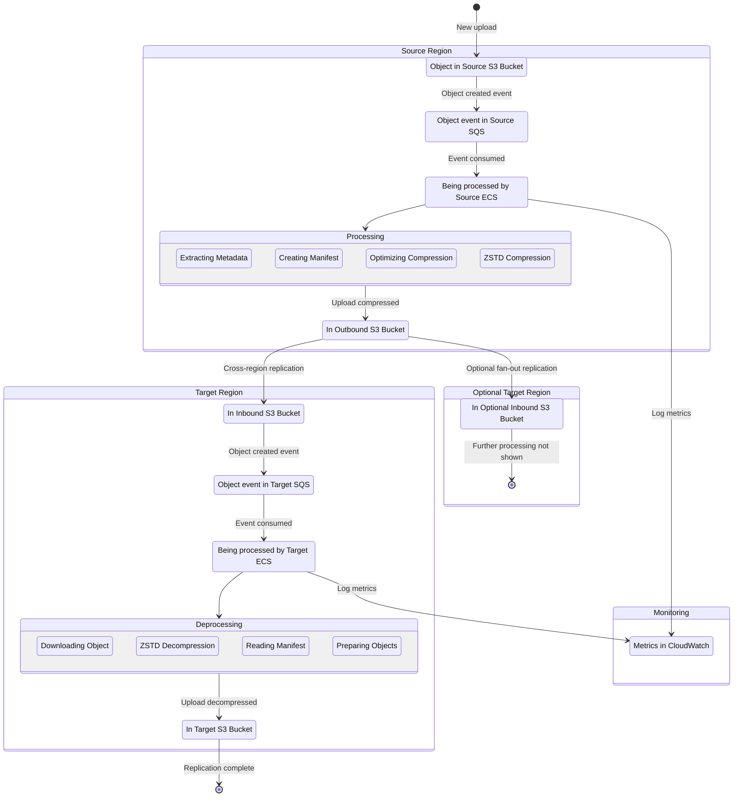

# Architecture Guide for S3 Cross-Region Compressor

This guide provides a detailed overview of the S3 Cross-Region Compressor architecture, including components, data flow, and implementation details.

## System Overview

S3 Cross-Region Compressor is designed to efficiently move data between AWS regions while minimizing data transfer costs through compression. The system consists of two primary components:

1. **Source Region Service**: Detects, processes, and compresses objects
2. **Target Region Service**: Receives, decompresses, and stores objects

## System Architecture Diagram

The system implements a pipeline architecture with the following components and data flow:

## Deployment Model

The S3 Cross-Region Compressor solution follows a specific deployment model to ensure efficient and targeted data transfer:

1. **Source Region Services**: 
   - **One service per source configuration**: For each entry in the `replication_config.json` file, a separate SQS queue and ECS service is deployed.
   - This means if you have multiple source buckets or even different prefix filters on the same bucket, each gets its own dedicated processing pipeline.
   - Each source service is responsible for handling objects from only its configured source bucket/prefix.

2. **Target Region Services**:
   - **One service per region**: Only one target service (SQS queue and ECS service) is deployed in each target region, regardless of how many source configurations send data to that region.
   - The single target service in a region processes compressed archives from all source services that replicate to that region.

3. **Rationale for this Model**:
   - This architecture ensures that each compressed TAR file only contains objects from a single source configuration that all need to be replicated to the same target region.
   - When a TAR file arrives in a target region, the target service knows which bucket the decompressed objects should be placed in based on the manifest.
   - This approach optimizes data transfer by grouping objects by their destination, avoiding the scenario where a single TAR file would need to be replicated unnecessary objects to a target region.

## Component Details

### 1. Source Region Infrastructure

> **Note:** Source region components are deployed once per source configuration in `replication_config.json`.

#### Source S3 Bucket
- User-managed S3 bucket containing original objects
- Can be encrypted with KMS (requires KMS key ARN in [replication_config.json](../configuration/replication_config.json))
- Monitored for object creation events

#### Source SQS Queue
- Receives S3 event notifications
- Used for asynchronous processing
- Provides backpressure for auto-scaling

#### Source ECS Service
- Fargate containers running the source processing code
- Fully deployed on Spot capacity for cost optimization
- Auto-scales based on SQS messages on a Backlog per Task strategy
   - Number of Backlog per Task can be configured via [replication_config.json](../configuration/replication_config.json)
   - Maximum number of tasks can be configured via [replication_config.json](../configuration/replication_config.json)
   - For detailed information on the autoscaling strategy, see [FARGATE_SCALING.md](FARGATE_SCALING.md)
- CPU/memory configurable via [replication_config.json](../configuration/replication_config.json)

More info in the [Source Region readme file](source_region/README.md)

#### Outbound S3 Bucket
- System-managed staging bucket
- Contains compressed objects pending replication
- Lifecycle policy to delete objects after successful replication
- Source for S3 cross-region replication

#### DynamoDB Table
- Stores compression metrics and settings
- Used by adaptive compression system
- Provides optimized compression levels per bucket/prefix

### 2. Target Region Infrastructure

> **Note:** Target region components are deployed once per region, regardless of how many source configurations replicate to that region.

#### Inbound S3 Bucket
- System-managed staging bucket
- Destination for S3 cross-region replication
- Monitored for object creation events

#### Target SQS Queue
- Receives S3 event notifications from Inbound bucket
- Triggers target region processing
- Provides backpressure for auto-scaling

#### Target ECS Service
- Fargate containers running the target processing code
- Fully deployed on Spot capacity for cost optimization
- Auto-scales based on SQS messages on a Backlog per Task strategy
- Decompresses objects and processes manifest

#### Target S3 Bucket
- User-managed destination bucket
- Receives decompressed objects
- Preserves original object structure, metadata, and tags

### 3. Shared Components

#### CloudWatch Metrics
- Comprehensive metrics for monitoring
- Compression ratios
- Processing times
- Cost savings
- Queue depths

#### KMS Keys
- Data at rest is always encrypted
- Region-specific keys are created by the solution
- Used for both source and target encryption

## Data Flow Details

### Source Region Processing

1. **Initialization and Startup**:
   - Runs CPU benchmark at startup to normalize performance metrics
   - Calculates optimal memory buffer sizes based on available system memory
   - Initializes the compression manager with CPU normalization factor

2. **Object Creation Detection**:
   - Object is created in the source S3 bucket
   - S3 event notification is sent to the source SQS queue
   - System automatically filters out S3 test events

3. **Message Processing**:
   - Source ECS service batch polls the SQS queue (up to 10 messages)
   - Uses ThreadPoolExecutor for parallel object downloading
   - Retrieves object metadata including tags and storage class
   - Calculates relative paths based on monitored prefix to preserve directory structure

4. **Compression Processing**:
   - Creates a manifest file with detailed object metadata, tags, and target information
   - Queries DynamoDB for optimal compression level with caching for efficiency
   - Occasionally tests different compression levels based on stability metrics
   - Archives the objects and manifest into a single TAR file
   - Deletes each file immediately after adding to the archive to conserve disk space
   - Compresses the TAR using zstd with multi-threading and dynamic buffer sizes
   - Deletes the TAR file after compression to save disk space

5. **Upload & Metrics**:
   - Uploads the compressed archive to the outbound S3 bucket with path preservation
   - Records detailed compression metrics in CloudWatch (ratio, bytes saved, processing time)
   - Updates compression metrics in DynamoDB with optimistic concurrency and automatic retries
   - Calculates stability metrics to detect performance plateaus
   - Deletes the SQS messages in batch operation

6. **Cross-Region Replication**:
   - Native S3 replication transfers the compressed archive to target region(s)
   - Uses AWS backbone network for efficient transfer
   - Replication configuration ensures each archive only goes to necessary regions

### Target Region Processing

1. **Compressed Object Detection**:
   - Compressed archive arrives in the inbound S3 bucket
   - S3 event notification is sent to the target SQS queue
   - System automatically filters out S3 test events

2. **Decompression Processing**:
   - Target ECS service polls the SQS queue (handling one message at a time)
   - Downloads the compressed archive to a temporary location
   - Decompresses the archive using zstd with multi-threading
   - Extracts only the manifest file initially

3. **Streaming Object Processing**:
   - Reads the manifest file to determine target buckets and metadata
   - Creates a map of objects to their metadata for efficient lookups
   - For each object in the archive:
     - Extracts just that one object from the TAR using streaming extraction
     - Processes the object (applies metadata, sets storage class)
     - Uploads to the appropriate target bucket
     - Immediately deletes the extracted file to free space
     - Moves to the next object

4. **Region-Specific Processing**:
   - Identifies which objects are intended for the current region
   - Processes only objects meant for the current AWS region
   - Skips objects intended for other regions

5. **Storage Class Handling**:
   - Preserves the original storage class by default
   - Can apply target-specific storage class overrides from configuration
   - Supports KMS encryption with target-specific keys

6. **Cleanup & Metrics**:
   - Records decompression metrics in CloudWatch with region-specific dimensions
   - Deletes the compressed archive from the inbound bucket after successful processing
   - Ensures all temporary files are removed, even after errors
   - Deletes the SQS message

## Technical Implementation

### AWS CDK Infrastructure

The system uses AWS CDK to define and deploy infrastructure:

1. **BaselineRegionCompressorStack**:
   - Core infrastructure for each region
   - VPC with private isolated subnets and VPC endpoints
   - Security groups, IAM roles with least privilege permissions
   - KMS keys for encryption with proper key policies
   - ECR repositories for container images
   - SNS topics for alarm notifications

2. **SourceStack / TargetStack**:
   - Region-specific components based on source_target configuration
   - S3 buckets with appropriate encryption and lifecycle policies
   - SQS queues with dead-letter queues for error handling
   - ECS clusters with Fargate Spot for cost optimization
   - DynamoDB tables for compression settings and parameters
   - CloudWatch dashboards for monitoring
   - CloudWatch alarms with email notifications

3. **S3ReplicationStack**:
   - Configures cross-region replication with proper IAM permissions
   - Creates replication rules for each source-destination pair
   - Implements rule priorities to prevent conflicts
   - Validates configuration to prevent replication loops

4. **Resource Creation Aspects**:
   - Log retention policies for all CloudWatch log groups
   - Capacity provider dependency hotfixes for ECS
   - Consistent tagging across all resources

### Source Region Container

The source region container (`bin/source_region/server.py`) implements:

1. **AWS Service Integration**:
   - S3 object retrieval with efficient metadata extraction
   - Batch SQS message processing (up to 10 messages at once)
   - Optimized boto3 configuration with increased connection pool size
   - Caching for parameter retrieval with TTL

2. **Compression System**:
   - Multi-threaded compression using pyzstd with configurable thread count
   - Dynamic buffer sizing based on available memory
   - Streaming compression for memory efficiency
   - Immediate file cleanup to conserve space
   - Preservation of directory structure using relative paths

3. **Adaptive Optimization Components**:
   - CompressionManager: Facade for compression operations with singleton pattern
   - CompressionOptimizer: Determines optimal compression levels with statistical analysis
   - CostBenefitCalculator: Analyzes compression vs. transfer costs with CPU normalization
   - CompressionSettingsRepository: Stores settings in DynamoDB with optimistic concurrency
   - CPU benchmarking for consistent performance metrics across instance types

4. **Error Handling & Resilience**:
   - Comprehensive exception handling
   - Signal handling for graceful shutdowns
   - Automatic retries for AWS service operations
   - Structured JSON logging for better observability

### Target Region Container

The target region container (`bin/target_region/server.py`) implements:

1. **AWS Service Integration**:
   - S3 object retrieval and upload with storage class preservation
   - Single-message SQS processing for careful resource management
   - Region detection and filtering for region-specific processing
   - Batch deletion of SQS messages
   - Optimized boto3 configuration with increased connection pool size

2. **Decompression System**:
   - Multi-threaded decompression using pyzstd
   - Memory-efficient streaming extraction of TAR files
   - Smart processing that extracts only one file at a time
   - Immediate cleanup after each file is processed
   - Support for storage class overrides from configuration

3. **Performance Optimization**:
   - Performance timing decorators to track processing time
   - Region-specific filtering to avoid unnecessary processing
   - Immediate resource cleanup to minimize memory and disk usage
   - Detailed processing metrics for monitoring and optimization
   - Structured JSON logging for better observability

4. **Error Handling & Resilience**:
   - Comprehensive exception handling with detailed error reporting
   - Signal handling for graceful shutdowns
   - Cleanup of temporary files even after errors
   - Stack trace logging for easier troubleshooting

## Security

The S3 Cross-Region Compressor implements comprehensive security controls across network, data, identity, and operational domains. 

For detailed security information, see [SECURITY.md](SECURITY.md).
