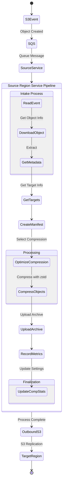

# Source Region Service

The Source Region Service is a critical component of the S3 Cross-Region Compressor system, responsible for detecting, compressing, and preparing data for efficient cross-region transfer.

## Architecture

The Source Region Service implements a compression pipeline with the following workflow:



## Core Functionality

### Initialization and Startup

The service performs important initialization steps when starting:
1. Runs a CPU benchmark to establish a performance baseline
2. Calculates optimal memory buffer sizes based on available system memory
3. Initializes the compression manager with CPU normalization factor
4. Configures structured JSON logging

### Event Processing

The service:
1. Polls SQS for messages containing S3 object creation events
2. Automatically filters out S3 test events
3. Processes messages in batches (configurable, default: 10 messages)
4. Uses ThreadPoolExecutor for parallel object processing
5. Implements visibility timeout to prevent duplicate processing

### Object and Metadata Handling

For each object:
1. Downloads the object to a temporary location with unique ID
2. Calculates relative path based on monitored prefix to preserve directory structure
3. Retrieves S3 object metadata including:
   - Full key and relative key for path preservation
   - Source bucket and prefix
   - Object size
   - Creation time
   - Object tags
   - ETag (MD5 checksum)
   - Storage class
4. Creates a manifest with detailed object details and target information

### Adaptive Compression System

The service implements an intelligent adaptive compression system that:

1. **Retrieves Optimal Settings**: Queries DynamoDB for the best compression level based on:
   - Source bucket/prefix pattern or DynamoDB key name
   - Historical performance metrics
   - Uses caching to minimize DynamoDB reads
   
2. **Dynamic Level Selection**:
   - Uses compression level 12 as default for new bucket/prefix patterns
   - Automatically adjusts based on historical performance
   - Implements version-based decay exploration rate (from 25% down to 12.5% over time) 
   - Uses multi-tier exploration strategy with budget allocation of 60% for ±1 level, 25% for ±2 levels, and 15% for ±3 levels
   - Uses statistical methods requiring minimum 10 trials per compression level
   
3. **Cost-Benefit Analysis**:
   - Calculates transfer savings based on bytes saved and number of target regions
   - Calculates compute cost using processing time and Fargate pricing
   - Includes 2.5% overhead factor in compute cost calculations
   - Uses configurable transfer and compute cost factors
   - Computes net benefit as transfer savings minus compute cost
   
4. **Performance Optimization**:
   - Uses multi-threaded compression with pyzstd
   - Adapts thread count based on available CPU cores
   - Dynamically sizes compression buffers based on available memory
   - Implements streaming compression to minimize memory usage
   - Maintains weighted metrics history in DynamoDB with file count weighting
   - Adjusts compression level based on CPU performance relative to fleet average

### Manifest Generation

Creates a standardized manifest file with the structure:

```json
{
  "objects": [
    {
      "source_bucket": "source-bucket-name",
      "source_prefix": "folder/path/",
      "object_name": "example.txt",
      "tags": [
        { "key": "tag1", "value": "value1" },
        { "key": "tag2", "value": "value2" }
      ],
      "creation_time": "2023-04-01T12:34:56Z",
      "etag": "cf13ebcc8f60b6d56cabd6a39cd92950",
      "targets": [
        {
          "bucket": "target-bucket1",
          "region": "us-east-2"
        },
        {
          "bucket": "target-bucket2",
          "region": "ap-southeast-2"
        }
      ],
      "size": 1234
    }
  ]
}
```

### Archive Creation and Upload

1. Creates a TAR archive containing:
   - Downloaded objects (in `objects/` directory with preserved relative paths)
   - Manifest file (as `manifest.json`)
   - Deletes each file immediately after adding it to the archive to conserve disk space
2. Compresses the TAR using zstd with:
   - The selected compression level
   - Multi-threading based on available CPU cores
   - Dynamically sized read/write buffers based on available memory
   - Streaming compression to minimize memory usage
3. Deletes the TAR file immediately after successful compression
4. Uploads the compressed archive to the outbound S3 bucket
5. Maintains original bucket/prefix structure in the outbound bucket's key
6. Deletes the compressed file after successful upload to save disk space

## Configuration

The Source Region Service is configured via environment variables:

| Variable | Description | Required | Default |
|----------|-------------|----------|---------|
| `SQS_QUEUE_URL` | URL of the SQS queue to poll | Yes | - |
| `AWS_DEFAULT_REGION` | AWS region code | Yes | - |
| `BUCKET` | Outbound S3 bucket name | Yes | - |
| `STACK_NAME` | Stack name for DynamoDB parameter lookup | Yes | - |
| `LOG_LEVEL` | Logging verbosity | No | INFO |
| `MONITORED_PREFIX` | Root prefix being monitored (for relative path calculation) | No | "" |
| `COMPRESSION_SETTINGS_TABLE` | DynamoDB table for compression settings | Yes | - |
| `DATA_TRANSFER_COST` | Cost per GB for cross-region transfer | No | 0.02 |
| `FARGATE_COST_PER_MINUTE` | Cost per minute for Fargate compute | No | 0.000395 |

## Performance Tuning

The service has several configurable parameters that affect performance:

| Parameter | Description | Default | How to Change |
|-----------|-------------|---------|--------------|
| `MAX_MESSAGES_PER_BATCH` | Number of SQS messages processed per batch | 10 | Code modification |
| `VISIBILITY_TIMEOUT` | SQS visibility timeout in seconds | 300 | Code modification |
| `MAX_WORKERS` | Number of compression threads | `os.cpu_count()` | Code modification |
| `POLL_INTERVAL` | Time between SQS polls when no messages found (seconds) | 20 | Code modification |
| `DEFAULT_COMPRESSION_LEVEL` | Initial compression level for new patterns | 12 | Code modification |

## CloudWatch Metrics

The service emits the following CloudWatch metrics under the `S3Compressor` namespace:

| Metric Name | Description | Unit |
|-------------|-------------|------|
| `CompressionRatio` | Ratio of original size to compressed size | Ratio |
| `BytesSaved` | Number of bytes saved by compression | Bytes |
| `CompressionTimeSeconds` | Time taken to compress objects | Seconds |
| `ObjectProcessingTime` | Total time to process objects | Seconds |
| `ObjectSize` | Size of original objects processed | Bytes |
| `FailedDownloads` | Number of failed object downloads | Count |
| `FailedMetadataRetrieval` | Number of failures to retrieve metadata | Count |
| `FailedUploads` | Number of failed uploads to outbound bucket | Count |
| `TransferSavings` | Estimated cost savings on data transfer | USD |
| `ComputeCost` | Estimated compute cost for compression | USD |
| `NetBenefit` | Net financial benefit (savings minus cost) | USD |
| `BenefitScore` | Weighted benefit score for optimization | Score |

## Memory Management

The service implements sophisticated memory management to optimize resource usage:

1. **Dynamic Buffer Sizing**:
   ```python
   # Detect available system memory
   available_memory = psutil.virtual_memory().available
   
   # Use 15% of available memory for compression
   max_buffer_memory = available_memory * 0.15
   
   # Allocate read and write buffers
   read_size = int(max_buffer_memory * 0.45)
   write_size = int(max_buffer_memory * 0.55)
   ```

2. **Streaming Compression**:
   - Processes files in chunks rather than loading entire files into memory
   - Uses pyzstd's streaming API with the configured buffer sizes

3. **Immediate Cleanup**:
   - Deletes files immediately after adding to TAR archive
   - Deletes TAR file immediately after compression
   - Deletes compressed file after successful upload
   - Ensures cleanup even in error scenarios

## Optimistic Concurrency Control

For DynamoDB operations, the service implements optimistic concurrency control:

1. Each settings record maintains a version number for concurrency control
2. Metrics updates are performed using atomic DynamoDB update operations
3. The system uses conditional expressions based on version numbers to prevent conflicts
4. Each record automatically increments its version with every update

This approach handles concurrent updates gracefully in distributed environments where multiple containers might process different objects with the same bucket/prefix pattern simultaneously.

## Error Handling

The service implements robust error handling:

1. **Temporary File Management**: Creates and cleans up temporary directories
2. **SQS Message Retry**: Visibility timeout ensures failed operations are retried
3. **AWS API Retries**: Exponential backoff and retry logic for AWS API calls
4. **Optimistic Concurrency**: Version-based updates with automatic retries for DynamoDB
5. **Graceful Shutdown**: Signal handlers for proper shutdown
6. **Exception Handling**: Comprehensive try/except blocks throughout the code
7. **Structured Logging**: JSON-formatted logs for better error diagnostics

## Integration Points

### Upstream
- **S3 Events**: Triggered by object creation in source buckets
- **SQS**: Receives messages from S3 event notifications

### Downstream
- **DynamoDB**: 
  - Stores compression settings and metrics 
  - Stores replication parameters
- **CloudWatch**: Reports detailed metrics and logs
- **Outbound S3 Bucket**: Destination for compressed archives
- **S3 Replication**: Transfers objects to target regions

## Related Documentation

- For general system architecture, see [ARCHITECTURE.md](../ARCHITECTURE.md)
- For adaptive compression details, see [ADAPTIVE_COMPRESSION.md](../ADAPTIVE_COMPRESSION.md)
- For cost optimization information, see [COST_OPTIMIZATION.md](../COST_OPTIMIZATION.md)
- For monitoring guidance, see [MONITORING.md](../MONITORING.md)
