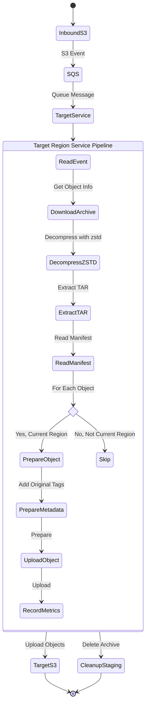

# Target Region Service

The Target Region Service is an essential component of the S3 Cross-Region Compressor system, responsible for receiving compressed data, decompressing it, and distributing objects to their final destinations in the target region.

## Architecture

The Target Region Service implements a decompression and distribution pipeline with the following workflow:



## Core Functionality

### Event Processing

The service:
1. Polls SQS for messages containing S3 object creation events in the inbound staging bucket
2. Automatically filters out S3 test events
3. Processes one message at a time (configurable, default: 1 message per batch)
4. Uses visibility timeout to prevent duplicate processing
5. Uses optimized boto3 client configuration with increased connection pool size

### Decompression Process

For each compressed archive:
1. Downloads the compressed TAR.ZSTD file to a temporary location with unique UUID
2. Decompresses the ZSTD file using multi-threaded decompression
3. Extracts just the manifest file initially (without extracting other files)
4. Processes the manifest file to determine target destinations
5. Gets list of all object members from the TAR without extracting them
6. Maps relative keys to object information for efficient lookups

### Manifest Interpretation

The service:
1. Reads the manifest.json file extracted from the archive
2. Parses object metadata including:
   - Original source bucket and prefix
   - Object names, sizes, and relative paths
   - Original tags and creation time
   - Original storage class information
   - Target buckets, regions, and optional target storage class overrides
   - KMS key ARNs for encryption

### Region-Specific Processing

The service implements region-specific object handling:
1. Identifies the current AWS region using instance metadata service
2. Groups targets into current-region targets and other-region targets
3. Processes only objects targeted for the current region
4. Skips objects targeted for other regions (they will be processed by Target Region Services running in those regions)
5. Logs detailed information about skipped targets for debugging and auditing
6. Logs target configuration details to help diagnose storage class and KMS key issues

### Streaming Object Processing

The service uses a memory-efficient streaming approach:

1. For each object in the archive:
   - Extracts just that one object from the TAR using streaming extraction
   - Prepares the target key maintaining the original prefix structure
   - Preserves original object tags
   - Applies the original storage class by default
   - Applies target-specific storage class override if configured
   - Applies KMS encryption with target-specific key if provided
   - Uploads the object to the appropriate target bucket
   - Immediately deletes the extracted file to free up disk space
   - Moves to the next object

This streaming approach minimizes memory and disk usage, allowing the service to process archives of any size without running out of resources.

### Storage Class Handling

The service provides flexible storage class management:

1. **Storage Class Preservation**: 
   ```python
   # Get original storage class from object info
   original_storage_class = object_info.get('storage_class', 'STANDARD')
   
   # Check for storage class override from target configuration
   target_storage_class = target.get('storage_class')
   
   # Use target storage class if specified, otherwise use original
   storage_class = target_storage_class if target_storage_class else original_storage_class
   ```

2. **Log Storage Decisions**:
   - Logs storage class decisions for auditing and troubleshooting
   - Records when original classes are preserved
   - Records when target overrides are applied

### Cleanup Process

After successful processing:
1. Records metrics for decompression ratio and processing time
2. Logs success/failure counts for the batch
3. Deletes the TAR file after completing extraction
4. Deletes the compressed archive from the inbound staging bucket
5. Ensures all temporary files are removed, even in error scenarios
6. Deletes SQS messages in batch after successful processing

## Configuration

The Target Region Service is configured via environment variables:

| Variable | Description | Required | Default |
|----------|-------------|----------|---------|
| `SQS_QUEUE_URL` | URL of the SQS queue to poll | Yes | - |
| `AWS_DEFAULT_REGION` | AWS region code | Yes | - |

## Performance Tuning

The service has several configurable parameters that affect performance:

| Parameter | Description | Default | How to Change |
|-----------|-------------|---------|--------------|
| `MAX_MESSAGES_PER_BATCH` | Number of SQS messages processed per batch | 1 | Code modification |
| `VISIBILITY_TIMEOUT` | SQS visibility timeout in seconds | 300 | Code modification |
| `MAX_WORKERS` | Number of parallel upload threads | `os.cpu_count()` | Code modification |
| `POLL_INTERVAL` | Time between SQS polls when no messages found (seconds) | 20 | Code modification |

## Performance Optimizations

The service implements several performance optimizations:

### 1. Performance Timing

The service uses decorators to track processing time:

```python
@track_processing_time
def process_s3_object(s3_object: Dict, temp_dir: str) -> Tuple[bool, str, Dict]:
    """Process an S3 object: download it and prepare for decompression."""
    # Implementation...
```

This allows for precise measurement of each processing stage without repetitive timing code.

### 2. Optimized File Handling

```python
# Stream extract just the one file we need
extraction_success = stream_extract_file(tar_path, member_name, extract_dir)

# Process and upload the file
upload_success = upload_object_to_targets(object_info)

# Delete immediately after upload
if os.path.exists(extracted_path):
    os.remove(extracted_path)
    logger.debug(f'Removed extracted file after upload: {extracted_path}')
```

This approach minimizes disk usage and enables processing of archives containing very large files.

## CloudWatch Metrics

The service emits the following CloudWatch metrics under the `S3Compressor` namespace:

| Metric Name | Description | Unit |
|-------------|-------------|------|
| `DecompressionRatio` | Ratio of compressed size to decompressed size | Ratio |
| `DecompressionTimeSeconds` | Time taken to decompress objects | Seconds |
| `ObjectRestoreTime` | Total time to process objects | Seconds |
| `ProcessingTimeByStage` | Time taken for each processing stage | Seconds |
| `FailedDecompressions` | Number of failed decompressions | Count |
| `FailedTargetUploads` | Number of failed uploads to target buckets | Count |
| `ObjectsProcessed` | Number of objects processed | Count |
| `SkippedObjects` | Number of objects skipped (for other regions) | Count |

## Error Handling

The service implements robust error handling:

1. **Comprehensive Exception Handling**:
   ```python
   try:
       # Processing code
   except Exception as e:
       logger.exception(f'Unhandled exception in process_message_batch: {traceback.format_exc()}')
   ```

2. **Structured Error Logging**:
   - Uses JSON-formatted logs for better searchability 
   - Includes stack traces for easier debugging
   - Includes context information like object keys and bucket names

3. **Resource Management**:
   - Creates and cleans up temporary directories in finally blocks
   - Ensures cleanup even after errors
   - Deletes extracted files immediately after use

4. **Resilient Processing**:
   - Individual object failures don't affect other objects
   - Tracks successes and failures for reporting
   - SQS visibility timeout ensures failed operations can be retried
   - Signal handlers for graceful shutdown

## Integration Points

### Upstream
- **Inbound S3 Bucket**: Receives compressed archives from the source region via S3 replication
- **SQS**: Receives messages from S3 event notifications when archives arrive

### Downstream
- **Target S3 Buckets**: Destination for decompressed objects
- **CloudWatch**: Reports detailed metrics and logs

## Multi-Region Considerations

The Target Region Service is designed for multi-region deployments:

1. **Region-Aware Processing**: Only processes objects intended for its region
2. **Independent Operation**: Target services in different regions operate independently
3. **No Cross-Region API Calls**: All operations happen within the local region
4. **Parallel Deployment**: Can be deployed to any number of regions specified in the configuration

## Related Documentation

- For general system architecture, see [ARCHITECTURE.md](../ARCHITECTURE.md)
- For configuration details, see [CONFIGURATION.md](../CONFIGURATION.md)
- For monitoring guidance, see [MONITORING.md](../MONITORING.md)
- For troubleshooting guidance, see [TROUBLESHOOTING.md](../TROUBLESHOOTING.md)
